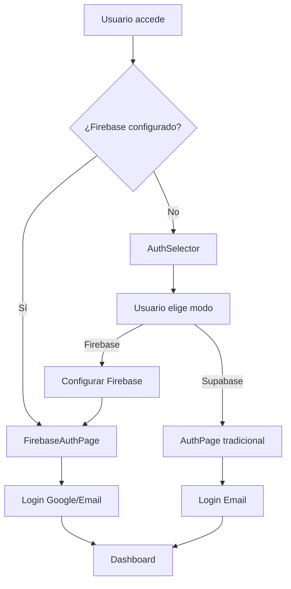

# 🔥 TallerPro - Firebase Edition

## Integración Completa con Google Cloud

TallerPro ahora incluye soporte completo para **Firebase** como backend alternativo, ofreciendo:

### 🌟 Características Firebase

- **🔐 Autenticación Google**: Login con un clic usando tu cuenta Google
- **📱 Autenticación Email**: Sistema tradicional de registro y login
- **🗄️ Firestore Database**: Base de datos NoSQL en tiempo real
- **⚡ Sincronización Instantánea**: Cambios en tiempo real entre dispositivos
- **🔧 Tu Propia Infraestructura**: Control total sobre tus datos
- **💰 Pago Directo**: Pagas directamente a Google Cloud

### 🛠️ Arquitectura Dual

TallerPro soporta dos modos de funcionamiento:

#### 1. **Modo Estándar** (Supabase)
- ✅ Configuración rápida y sencilla
- ✅ Base de datos PostgreSQL
- ✅ Ideal para la mayoría de usuarios

#### 2. **Modo Google Cloud** (Firebase)
- 🔥 Autenticación Google nativa
- 🔥 Base de datos Firestore en tiempo real
- 🔥 Integración con Google Workspace
- 🔥 Tu propia instancia Firebase

## 🚀 Configuración Rápida Firebase

### 1. Crear Proyecto Firebase

```bash
# 1. Ve a https://console.firebase.google.com
# 2. Crear nuevo proyecto: "tallerpro-tu-nombre"
# 3. Habilitar Authentication (Email + Google)
# 4. Crear Firestore Database
```

### 2. Configurar en TallerPro

1. **Seleccionar Modo**: En la pantalla de bienvenida, elige "Modo Google Cloud"
2. **Configurar Firebase**: Ve a Almacenamiento → Firebase y pega tu configuración
3. **Probar Conexión**: Verifica que todo funcione correctamente
4. **¡Listo!** Ahora puedes usar autenticación Google

### 3. Configuración JSON Ejemplo

```json
{
  "apiKey": "AIzaSyAbc123...",
  "authDomain": "tu-proyecto.firebaseapp.com", 
  "projectId": "tu-proyecto",
  "storageBucket": "tu-proyecto.appspot.com",
  "messagingSenderId": "123456789012",
  "appId": "1:123456789012:web:abc123def456"
}
```

## 📋 Comparación de Modos

| Característica | Supabase | Firebase |
|---|---|---|
| **Configuración** | ⚡ Inmediata | 🔧 Requiere setup |
| **Base de Datos** | PostgreSQL | Firestore NoSQL |
| **Autenticación** | Email | Email + Google |
| **Tiempo Real** | ✅ WebSockets | ✅ Nativo |
| **Costo** | Incluido | Tu cuenta Google |
| **Control** | Compartido | 100% Tuyo |

## 🎯 Casos de Uso

### Usa **Supabase** si:
- ✅ Quieres empezar rápidamente
- ✅ Prefieres SQL tradicional
- ✅ No necesitas Google integrations
- ✅ Quieres que todo esté incluido

### Usa **Firebase** si:
- 🔥 Quieres autenticación Google
- 🔥 Necesitas sincronización en tiempo real
- 🔥 Prefieres tu propia infraestructura
- 🔥 Quieres integrar con Google Workspace
- 🔥 Planeas escalar significativamente

## 🔧 Funcionalidades Implementadas

### Autenticación Firebase
```typescript
// Login con Google (un clic)
const { user, error } = await firebaseService.signInWithGoogle();

// Login con email tradicional  
const { user, error } = await firebaseService.signInWithEmail(email, password);

// Registro con datos adicionales
const { user, error } = await firebaseService.signUpWithEmail(email, password, {
  workshopName: "Mi Taller",
  contactPerson: "Juan Pérez"
});
```

### Base de Datos Firestore
```typescript
// Agregar documento
const { id } = await firebaseService.addDocument('clientes', clienteData);

// Obtener documentos del usuario
const clientes = await firebaseService.getUserDocuments('clientes');

// Listener en tiempo real
const unsubscribe = firebaseService.subscribeToUserDocuments('clientes', (clientes) => {
  // Actualización automática cuando cambian los datos
  setClientes(clientes);
});
```

### Migración de Datos
```typescript
// Migración automática desde localStorage
const { success, migrated, errors } = await firebaseService.migrateFromLocalStorage();
```

## 🏗️ Arquitectura Técnica

### Servicios Implementados

1. **`firebaseService.ts`**: Manejo completo de Firebase
   - Autenticación (Google + Email)
   - Operaciones CRUD Firestore
   - Listeners en tiempo real
   - Migración de datos

2. **`FirebaseAuthPage.tsx`**: Interfaz de autenticación Firebase
   - Diseño optimizado para Google
   - Botón Google prominente
   - Formularios tradicionales como fallback

3. **`useFirebaseAuth.ts`**: Hook de autenticación
   - Estado de usuario
   - Listeners de cambios
   - Funciones de logout

4. **`FirebaseDataContext.tsx`**: Contexto de datos
   - CRUD operations centralizadas
   - Estado global de colecciones
   - Sincronización en tiempo real

5. **`AuthSelector.tsx`**: Selector automático
   - Detecta configuración existente
   - Permite elegir modo de autenticación
   - UI intuitiva de selección

### Flujo de Autenticación



## 💰 Costos Firebase

### Plan Gratuito (Spark)
- **Firestore**: 50,000 lecturas/día, 20,000 escrituras/día
- **Authentication**: Usuarios ilimitados
- **Storage**: 1 GB

### Estimación Mensual por Taller
- **Pequeño** (1-2 usuarios): €0-2/mes
- **Mediano** (3-5 usuarios): €2-8/mes  
- **Grande** (5+ usuarios): €8-25/mes

*Mucho más económico que soluciones empresariales tradicionales*

## 🛡️ Seguridad

### Reglas Firestore Implementadas
```javascript
rules_version = '2';
service cloud.firestore {
  match /databases/{database}/documents {
    // Solo usuarios autenticados
    match /{document=**} {
      allow read, write: if request.auth != null && 
        resource.data.userId == request.auth.uid;
    }
  }
}
```

### Características de Seguridad
- 🔐 **Autenticación JWT**: Tokens seguros renovables
- 🛡️ **Aislamiento de datos**: Cada usuario solo ve sus datos
- 🔒 **HTTPS Obligatorio**: Toda comunicación encriptada
- 🚪 **Logout automático**: Sesiones con tiempo límite

## 📊 Ventajas Competitivas

### Para Talleres Pequeños
- **Costo mínimo**: Plan gratuito para empezar
- **Escalabilidad**: Crece con tu negocio
- **Simplicidad**: Login con Google familiar

### Para Talleres Grandes
- **Rendimiento**: Base de datos distribuida globalmente
- **Fiabilidad**: 99.95% uptime garantizado por Google
- **Integraciones**: Compatible con Google Workspace, Drive, etc.

### Para Desarrolladores
- **Tiempo real**: Sincronización automática
- **APIs modernas**: SDK JavaScript completo
- **Documentación**: Respaldado por Google

## 🔄 Migración y Backup

### Migración Automática
- ✅ Desde localStorage a Firestore
- ✅ Preserva todas las relaciones
- ✅ Validación de integridad de datos

### Backup Automático
- ✅ Backup diario automático (Firebase)
- ✅ Retención configurable
- ✅ Restauración point-in-time

## 📈 Roadmap Firebase

### ✅ Implementado
- [x] Autenticación Google + Email
- [x] Firestore CRUD completo
- [x] Sincronización tiempo real
- [x] Migración de datos
- [x] Interfaz integrada

### 🔮 Próximas Funciones
- [ ] Firebase Storage para archivos
- [ ] Push Notifications
- [ ] Firebase Analytics integrado
- [ ] Backup automático a Google Drive
- [ ] Integración Google Calendar (citas)

## 📞 Soporte

### Documentación
- 📖 [Firebase Setup Guide](./FIREBASE_SETUP.md)
- 📖 [Guía de Migración](./docs/migration.md)
- 📖 [FAQ Firebase](./docs/firebase-faq.md)

### Contacto
- 📧 **Email**: mitaller@mitallerenlinea.org
- 💬 **Soporte**: Disponible en horario comercial
- 🐛 **Bugs**: Reportar via email con detalles

---

## 🎉 ¡Empieza Ahora!

1. **Registra tu proyecto**: [Firebase Console](https://console.firebase.google.com)
2. **Configura TallerPro**: Modo Google Cloud en primer inicio
3. **Invita a tu equipo**: Comparte el enlace de tu taller
4. **¡Disfruta de Google Cloud!** 🔥

*TallerPro + Firebase = La combinación perfecta para talleres modernos* ⚡
